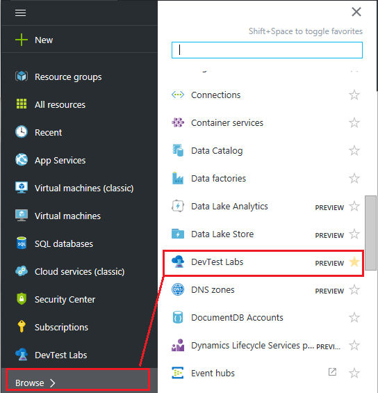
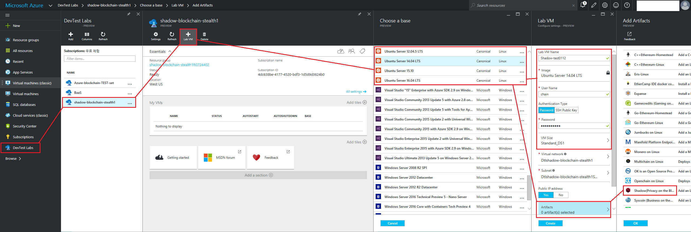
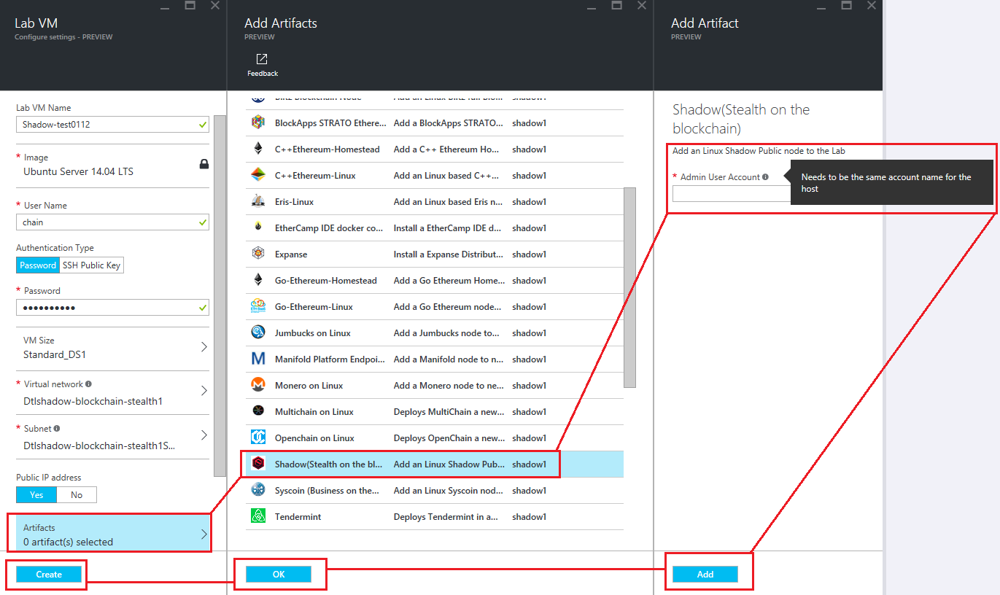
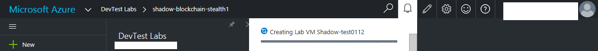

# Shadow Public Blockchain Node

This lab will have you create a public node Shadow Blockchain in Azure. 

Before starting the tutorial, you will have to "Adding Blockchain Artifact Library to Azure DevTest Labs" first. https://github.com/HyperSpaceChain/azure-blockchain-projects/blob/master/baas-artifacts/README.md  

Follow these very simple steps: 
1. Locate DevTest labs. You may need to Browse> for it in the Azure portal left hand Nav  
 
 
2. Simply click on the following: (To view a larger image, click and select RAW.) 
    2.1. Lab VM Name, Username, Password will do as you wish.  
    2.2. VM Size allows you to adjust the performance of the virtual machine.  
 
 
 
 
3. Time to generate a lab vm is about 15 minutes.  
 
 
4. Copy the IP or DNS address so you can SSH into it  
*If you do not have SSH capabilities you can install a tool like Putty http://www.putty.org/ while you are waiting  
5. Open a SSH client like PuTTY and paste your node IP or DNS address in to connect.  
 
 
6. Login using your admin account.  

7. shadow account command is as follows: : shadowcoind  
8. For example we will try to type the following: : shadowcoind getinfo  
 
 
9. To view the command of 'shadowcoind', enter the following:  
shadowcoind help  
shadowcoind -?

 
 

This Microsoft Azure template deploys a single Shadow client which will connect to the public Shadow network.

For more information,  
https://shadowproject.io  
https://bitcointalk.org/index.php?topic=745352  
# Template Parameters

When you click the Deploy to Azure icon above, you need to specify the following template parameters:

* `adminUsername`: This is the account for connecting to your Shadow host.
* `adminPassword`: This is your password for the host.  Azure requires passwords to have One upper case, one lower case, a special character, and a number.
* `dnsLabelPrefix`: This is used as both the VM name and DNS name of your public IP address.  Please ensure an unique name.
* `installMethod`: This tells Azure how to install the software.  The default is using the Binaries.  You may choose to install from Source, but be advised this method takes substantially longer to complete.
* `vmSize`: This is the size of the VM to use.  Recommendations: Use the A series for Binaries installs, and D series for installations from Source.

# Getting Started Tutorial

* Click the `Deploy to Azure` icon above
* Complete the template parameters, choose your resource group, accept the terms and click Create
* Wait about 15 minutes for the VM to spin up and install the software
* Connect to the VM via SSH using the DNS name assigned to your Public IP
* If you wish to launch Shadow run 'shadowcoind'