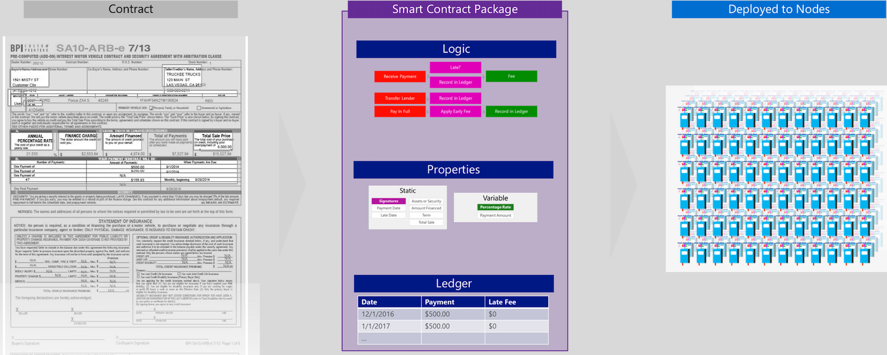
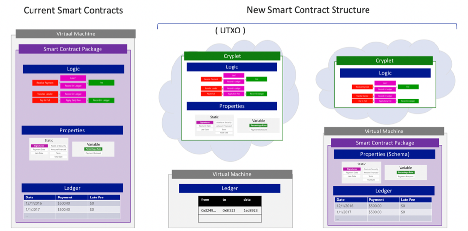
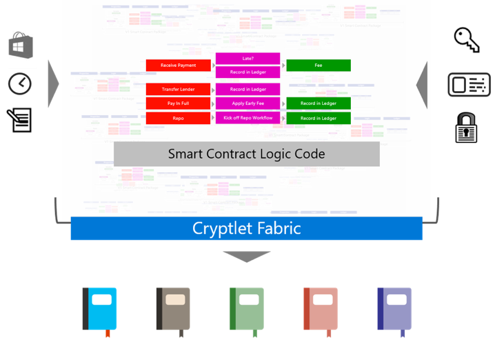

# Anatomy of a Smart Contract
*Marley Gray & Craig Hajduk - Microsoft*
<h2>Introduction</h2>

Although the concept of smart contracts was introduced in
the late 1990s by <a href="https://en.wikipedia.org/wiki/Nick_Szabo">Nick Szabo</a>, it remained an abstract concept until the Frontier
release of Ethereum in 2015. That release was the first implementation of smart
contracts, and was enough to move them from a concept to a reality. However, as
the community experimented with the technology, it became clear that new
requirements would need to be met before they could be deployed at scale.

This paper places the development of smart contracts in a
historical context, and explains a method for addressing new requirements that
maintains the benefits of the initial implementation in Ethereum. With these
modifications, smart contracts still deliver on their core promise, but can be
developed in a flexible environment that meets the needs of the enterprise. 

<h2>A Brief History of Architectures</h2>

It's easiest to understand the evolution of smart contracts
by seeing their development in the context of how software development
paradigms have shifted over time.

In the 1990s, the PC revolution led enterprises to move to client/server
applications, and away from mainframe-based, dumb terminal or single-tiered
applications. Enterprise developers started building 2-tiered applications
where data was separate from the client or business logic.

Initially, client applications held the business logic and
UI code. Tools like PowerBuilder and Visual Basic raced to have the best UI
frameworks, control libraries and developer experiences so enterprise
developers could create the best-looking, most performant experiences.&nbsp; As
developers added more business logic, control presentation, input and
application interoperability functionality, the client installation footprint
on PC hard disks grew tremendously. That bloat led to them being called "fat
clients" because of their deployment requirement to fully install all the code
and libraries.

Minimizing the use of network bandwidth between the data and
logic tiers was an important design objective. Clients that requested too much
data could timeout, crash the server, or clog the network. Optimizing database
performance became a critical part of application design. Stored Procedures
helped improve performance by allowing data access and validation logic to run
on the data tier. They also simplified development by exposing logic for
clients to perform create, read, update and delete (CRUD) operations without
hand-writing SQL statements.

Over time, problems emerged. Dependencies on stored
procedures and lifecycle management challenges reduced agility and increased
vendor lock-in. The advent of the internet pressured developers to create
applications that could handle thousands of clients concurrently rather a few
hundred. And while technology solutions like Database Connection Pooling, RPC-based
remote object invocation and CORBA, DCOM, and Java RMS mitigated the problems, they
didn't address the fundamental issues. 

After several years of trial and error, a new paradigm was
born: a 3-tiered architecture, with separate presentation, business logic and data
tiers. The data tier continued to be RDBMS Servers, while database connection
pooling, distributed transaction coordination, and remote object techniques
were run in the business logic tier. The presentation tier became web servers
with HTML and JavaScript.

The tiers represented actual hardware components, servers
and networking devices that supported software layers defined by the type of
logic that ran in them. The presentation layer contained user interface logic such
as input validation, control focus to guide users through application input
flow, data presentation and data binding. The business logic layer defined the
API for the presentation, or any other system that wanted to interact with the application.
Eventually, this layer became stateless, which allowed it to scale horizontally
using network load balancers. It also allowed for the complete abstraction of
the data layer, and provided composite interfaces across multiple back ends for
better integration.

The data logic layer contained logic for creating, reading, updating
and deleting data for the underlying data platform. That was primarily written
in SQL-based stored procedures, but newer big data, No-SQL and blockchain were
also included. 

With this architecture, deployment was much simpler; a developer
could simply map the logic layer on top of the physical tiers based on the
scale, security and performance that was needed. This separation of concerns let
layers scale horizontally, by adding more computers in the tier, or vertically,
by upgrading the amount of resources for single computers. This approach removed
brittle, tight couplings between systems, making modularity, versioning, (.dll
hell) and client deployment much easier. Not surprisingly, Separation of
Concerns became a best practice. It continues to be an important paradigm today
in modern micro-service architectures. 

<h2>The Initial Smart Contract Implementation</h2>

Seeing the initial development of smart contracts in a
historical context highlights the limitations of the initial implementation,
and provides guidance on how smart contracts will need to evolve. <a href="#_edn1" name="_ednref1" title="">[i]</a> 

The initial release of smart contracts in Ethereum was
designed to give parties that don't trust each other a way to enter into an
agreement, where they can be confident that the transaction will unfold as they
intend, and where they can verify the status of the contract or transaction at
any time. 

To achieve those design goals, the initial smart contracts implementation
didn't follow the typical patterns for application development. Specifically, it
included the logic, properties, and data in a single package, essentially
collapsing the business and data logic layers into a single layer, which are
then written to the blockchain. That provides the immutability, deterministic
execution and transparency required in untrusted environments.

Contracts are generally written in Solidity (Serpent and
others are supported as well) where data structures, functions for business
logic, and authorization based on addresses are checked. The source code is
compiled into bytecode, and deployed to all nodes on the blockchain for
execution. When a DApp is configured properly, it sends a message or
transaction to a function of the corresponding smart contract. To do that, it
needs the ABI (Application Binary Interface) to correctly format the message
and digitally sign it for submission.&nbsp; Once the message is received by a
node on the network, it is replicated to all the nodes on the network for
execution. 

Unfortunately, the initial approach presents challenges that
are often difficult for DApp (Distributed Application) developers. A DApp's
presentation logic has dependencies at runtime, such as an address of a node on
the network (DNS, IP, URI), as well as a port to communicate with <a
href="#_edn2" name="_ednref2" title="">[ii]</a>. The
DApp also needs to know the Ethereum address of the smart contract that is
deployed on the blockchain, which is not easily discoverable. Finally, it also needs
access to secure private keys, which can be manually inserted by using a file,
a blockchain wallet, or a secure device.

The current smart contract model is optimized for public,
untrusted networks. Replication helps provide authenticity and agreement across
untrusted networks, but it comes at a cost; if there are 1,000 nodes on the
network, the smart contract function of a single DApp is executed 1,000 times
each time it's requested. The slowest node in the blockchain defines the upper
limit of execution speed for the entire network, and the more logic included in
the smart contracts, the slower the network executes. The performance
implications can be crippling for business-to-business scenarios in trusted or
semi-trusted environments.&nbsp; 

<h2>Providing Flexibility with Cryptlets</h2>

There should be a choice for software architects that are
designing applications that use smart contracts. While scenarios in untrusted
or public environments may require a unified smart contract package, applications
running in trusted or semi-trusted networks would benefit from a typical enterprise
application development pattern.

If we think about blockchains as the data layer deployed in
a three-tiered architecture, only a subset of the features of a smart contract
should be implemented on the blockchain<a href="#_edn3" name="_ednref3" title="">[iii]</a>.
Complex business logic should be removed from the execution path, which allows the
data tier to be optimized to reflect the distributed nature of the network. <a href="#_edn4" name="_ednref4" title="">[iv]</a>

To pull business logic up above the blockchain to a separate
middle layer, the logic code needs access to a variety of services, including
secure execution, attestation, identity, cryptographic support, data
formatting, reliable messaging, triggers, and the ability to bind that code to
schema in specific smart contracts on any number of blockchains. Those services
can be provided in a fabric, where the individual pieces of code that support
the smart contracts can execute, send transactions to blockchain nodes, and be
bound to the schema in the data tier. 

We refer to these code blocks as Cryptlets, and the execution
environment they run is called the Cryptlet Fabric.

<h2>Refactoring a Smart Contract</h2>

To get a clearer picture of how
this separation of concerns is achieved, we can separate out the different
portions of a smart contract into discrete components. These basic components
are the properties (static and variable), the logic and the ledger. Each of
these components can be mapped directly into technical concepts. Properties
represent a data schema, logic represents code, and the ledger corresponds to a
database. Once each of these components are defined, they can be deployed to
environments that are optimized for their function. 

Recall that in today's version of smart contracts, there is
a single deployment model to a single computer or a node. That node is
replicated so that each node runs every smart contract, and produces the exact
results for each contract step that all other nodes produce. The contract is
deterministic, which means that each copy of the contract produces the same
output when the inputs are identical.

Figure 1: Creating a
Smart Contract

With Cryptlets, once we separate the data and ledger from
the logic, we can create a platform for the logic to run optimally. The contract's
logic is packaged into a Cryptlet, which is a block or blocks of code that run
inside a container, inside a fabric. 

Figure 2: Smart
Contracts Reimagined

The smart contract is now a composite of the on-chain
Solidity smart contract that defines the data schema on the blockchain, and a
Cryptlet that hosts the logic for the smart contract. These Cryptlets can be run
on a different computer or the cloud, rather than the actual nodes, and as a
result, do not need to be executed by every node on the network. 

Cryptlets execute in a secure computational environment, and
have the cryptographic primitives that allow them to work directly with blockchains,
thereby extending smart contracts off the blockchain within the same security
envelope.

<h2>A New Trust Model</h2>

With the introduction of a new computational tier, a new
trust model can be applied to blockchain applications. Public blockchains like
Bitcoin and Ethereum operate in a trustless model, where trust is placed in the
cryptography (hashes and digital signatures) and consensus algorithms such as proof-of-work
that mitigate the threat from malicious nodes.&nbsp; Counterparties in transactions
are pseudo-anonymous, and if things go wrong, the parties have little or no
recourse.

Consortium blockchains are different. They can deploy
applications to permissioned blockchains using a variety of blockchain cores,
such as Hyperledger Fabric or <a href="https://monax.io/">Monax</a>. These
generally aren't trustless environments since participants' addresses are
mapped to known identities in an identity service like <a
href="https://www.okta.com/">Okta</a> or Azure Active Directory. These can be
called semi-trusted networks, where the parties know who they are transacting
with, and if someone misbehaves, existing models and legal frameworks provide
an avenue for corrections or recourse. As a result, the network may use other
consensus algorithms like proof-of-stake or PBFT, and achieve a much higher
transaction rate.&nbsp; 

Cryptlets introduce a different implicit trust model, where they
themselves execute with a known identity in a secure environment, and produce
cryptographic proofs for all their outputs. If they are given permissions by
another party, they can also assume that party's identity, and digitally sign
transactions on its behalf. This trust model can be used with either a
trustless (public) network or semi-trusted network (consortium), essentially
creating a third area that can straddle both network types.

<h2>Advantages and Implications</h2>

There are many advantages that come with this new framework.
Possibly the most important aspect of the Cryptlet approach is the choice and
flexibility it provides. Developers can work in the languages they prefer, and
deploy each part of the smart contract to an environment that meets their needs
for scale, lifecycle management, monitoring, transparency, and immutability. It
also means that:

- Data schema and validation logic on the blockchain is maintained

- There is still distributed data and trust at the data layer

- The logic layer has discretionary trust between concerned parties
only

- Since the logic isn't dependent on the blockchain itself, trusted
data and logic is portable across blockchains

- Confidentiality is easier to achieve by putting code, or counter
party secrets like keys and independent terms, within a Cryptlet

- It's possible to version logic independently from data and schema

<h2>Moving Forward with Smart Contracts</h2>

In summary, smart contracts can be decomposed into layers
and deployed into separate tiers providing the goodness of a blockchain ledger
for the database and Cryptlets for scalable smart contracts.&nbsp; The implementation
is a choice by the application architect:

- A Solidity-based (or other language) smart contract that is 100%
on the blockchain, or combined with a side-chain for privacy. This preserves
the atomicity of the original smart contract design, which may be optimal for
untrusted or public blockchain applications.

- Database schema and validation logic on the blockchain, with the
smart contract logic and behavior running in Cryptlets. This keeps blockchain
code to a minimum, and provides the benefits you'd expect for typical cloud
services.

- A UTXO Transaction Database and a Cryptlet hosting the smart
contract data schema, logic and behavior. This provides similar benefits to the
second case, but applies to UTXO blockchain scenarios.

And now, a quick teaser for the next white paper: <i>Bletchley:
A Cryptlet Fabric in Depth</i>. In that paper, we'll explore how the Fabric
makes a 3-tiered blockchain architecture real. The following diagram will play
a big part, but we'll let you have a peek:

Figure 5: The Cryptlet Fabric

______________________
**Footnotes**

<a href="#_ednref1" name="_edn1"
title="">[i]</a> It's important to realize that smart
contracts are not native to all blockchains. UTXO blockchain nodes usually have
very simple virtual machines. These systems generally don't support complex
data structures; assets on a UTXO blockchains have data properties but no
defined schema or behavior. They don't allow behaviors associated with smart
contracts, but use accounts, UTXOs and virtual machine OPCODES to connect
applications. These systems are generally better for scenarios like tracking
asset lineage, such as a digital bearer scenario.&nbsp; Bitcoin's entire design
is optimized for this use case.

<a href="#_ednref2"
name="_edn2" title="">[ii]</a> One interesting nuance here is that the presentation
layer of DApps is often centralized on a web server, which goes against the
idea of a truly decentralized application. Building a truly decentralized, un-censorable
application would require a different approach.

<a href="#_ednref3"
name="_edn3" title="">[iii]</a> The parts of the traditional smart contract package
that are appropriate for being on the blockchain would be database schema,
validation and verification of transactions that append to the ledger, and
query optimization logic for reading the ledger.

<a href="#_ednref4" name="_edn4"
title="">[iv]</a> For this paper, we'll focus on
implementing separation of concerns at the business and data layers. We'll
address the presentation or user interface later in a future paper.

______________________

**This project has adopted the Microsoft Open Source Code of Conduct. For more information see the Code of Conduct FAQ or contact opencode@microsoft.com with any additional questions or comments.**
