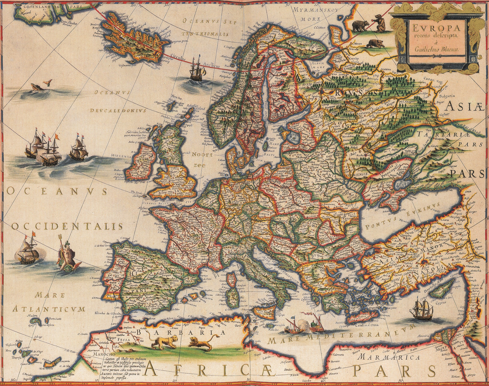
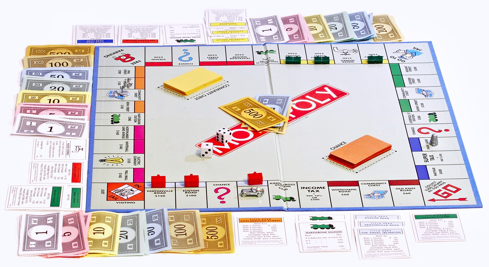

# The Bletchley Map

## A blockchain related series about Tokens, Contracts and Identity...oh my

Welcome to the Bletchley Map, your trusty guide for Tokens, Contracts and Identity in the exciting world of blockchains.

## Start

If you are new to blockchains (a.k.a. distributed ledgers) or even been immersed in them for years, you may find yourself helplessly confused or lost in the deep dark woods. You may be asking yourself, what is this all about? What was I doing in the first place?

The Bletchley Map is for you.

Here we take a step back, or zoom out if you will, to reevaluate the big picture. What makes blockchains seem so interestingly magical to some and often dismissed by others?

Previous papers in the Token series provide an introduction and guide for you to grasp the basic concepts involved when approaching blockchains. So we will not dip into the whole distributed consensus algorithms burrow nor will we debate varying approaches of achieving some usable level of privacy.

But often, those who are immersed in experiments or proof of concept projects, come up for air and ask themselves, couldn’t I have just used a traditional database or application for this? Is what I am trying to do even a valid use case for blockchains?

And shouldn't the previous question be: Is what **we** are trying to do even a valid use case for blockchains?

So, this map will bring you back to the basics and help guide your thinking and approach to true multi-party, distributed applications using blockchain technologies.

But first, a bit of level setting here for our first topic, Tokens. There are currently two token universes at the moment. A public universe heavily tilted towards crypto currency use cases that features a diverse and wide selection of blockchain choices each of them differentiating themselves on the technical underpinnings and evolving new economic models. And an enterprise or corporate universe that provides a narrower choice of blockchain technologies focusing on evolving existing economic models with a more diverse and wide view of tokens.

At some point the boundary between these two universes, public and private, will blur as the technology and social, economic, legal, regulatory and practical aspects involved with this disruptive technology matures.  But for now, it’s pretty safe to think that the use of tokens in the public universe is narrowly focused on different versions of money or crypto currency and the private universe is widely focused on tokens that are not.

Again, this will change and there are crossovers and I’m sure someone will take offense at this generalization, which is probably an indication that this paper is not for you.

## Building Blocks

There are 3 basic building blocks: Tokens, Contracts and Identity when conceptualizing a blockchain application.  Before we jump in, lets pin a simple definition of what the underlying blockchain or shared ledger is:

>A shared ledger uses cryptography that is trusted by multiple parties to authentically represent tokens or assets of value that can be owned by accounts belonging to the parties that trust it.

Wow, that is a mouthful and can get WAY more complicated. But for all intents and purposes, this definition of a ledger that represents a shared "truth", or is really good at establishing authenticity using cryptography is the only thing you really need to understand to be able to envision what you might be able to do with it.

## Tokens

### Monopoly and Bearer Instruments

Tokens are representations of something. Think about the board game Monopoly - the whole game is tokens. You have the game piece that each player chooses to represent themselves in the game. You also have the property cards a player purchases. Oh, and the money the players earn and use to purchase those properties and the "Get out of Jail" card a player can draw when they get into trouble.

Each of those things represents a token, but these tokens are not of the same type.  A game piece represents a player, or say an identity or account.  The money represents, well, physical money and the property cards represent a land deed or title.  Note, the property cards also contain details like rents or fees which represent contracts, which we will cover later.

In the Monopoly game, the money and property cards are *bearer instruments*. Meaning, a player can be the owner of money or property, no strings attached. Which is to say, when the game is over, no record is kept of who previously owned a property or held that particular $500 bill.  So a bearer instrument is anonymously sold or redeemed.

>Note, we are using the term bearer instrument generally to describe the concept not describe actual financial instruments

You know the saying, "possession is 90% of the law", well that means if you possess or bear the instrument, say a dollar, you are the owner and can do anything you want to with it. Physical money, in your hand, pocket, etc. is a kind bearer instrument. Historically, so were some stocks, bonds and titles as proof of asset ownership. These are pretty scarce today for numerous reasons, which we will get into later.

So, digital tokens are not generally bearer instruments, in fact by default they are anything but. A blockchain token has a full history or lineage which can be traced back to its origin. This level of scrupulous record keeping makes it difficult to hide if your account number happens to become is known.

Anyway, discussing the history of bearer instruments is really useful in understanding how token can represent something valuable. A digital token can represent some asset of tangible value, which is owned by another token that usually represents an identity or account.

>Translation: The dog owns Park Ave...which means if you are the player who chose the dog, you should have the Park Ave. property card on your side of the board.  Lucky you!

### Authenticity

Back to bearer instruments, they belong to the holder and are used just like physical money.  The single most important thing about any bearer instrument, regardless of its form, is its **authenticity**.  

For example, if you have a $100 bill with a serial number of `H4829310239` and come across another $100 bill with a serial number `H4829310239`, one of them is a counterfeit. But which one?  

How much is your $100 worth now?  $50? No $0 - you can't trust the dollar bill your are holding.

A bearer instrument's value is a zero sum game of confidence. Absolutely authenticity or the extreme unlikelihood of being able to produce a convincing counterfeit, is the name of the game.

Where does this trust in authenticity and how do we determine it?  Well it depends on the properties of the instrument.

### The Journey From Gold to Bearer Instrument

The authenticity of gold coins was initially determined dentally, which at the time meant evaluating coins was risking your gleaming smile as the dentist was also likely the town blacksmith. Anyway, a gold coin is not a bearer instrument because the coin itself has value. You could melt it down into a gold blob and its value would be the same. Because of this, gold coins were of great value in of themselves but came with a lot possession risk that often led to problems dwarfing the state of your dental health.

It wasn’t until the issuers of coins began plating rubbish materials with precious metals that their value was greater than their melted form. This was an interim step in the direction of full on material substitution to make the coin by using low valued metals and even paper to represent a blob of gold held by the issuer of the coin.

>The bearer instrument was born, well kind of. Meaning, the notion of a token as the bearer instrument representing value located somewhere else. Risk in using gold as currency could simply be the possession of them, with a bearer instrument the risk resided in determining authenticity when accepting it as payment for your labor or an asset you are selling.

If a rubbish material coin or paper bill represented a certain quantity of gold held in the issuers coffers, safe or vault, the bearer of the coin or bill could march right up to this institution and exchange the bearer instrument for the amount of gold it represented.

This is often called the Gold Standard, which technically its not, regardless this token scheme was the trust anchor underlying fiat currencies around the world until the early 1970s. The bearer of these instruments trusted that the institution that issued it had the gold to back it up, so all they had to worry about was that the instrument itself was authentic.

>Note, historically, minted coins where government issued currency and paper notes were bank or institutional issued instruments. This was the norm, until a sufficient number of crisis and fiduciary judgement days required for humanity to eventually learn that was generally a bad idea.

So, in a way, a good measure of the general trust in a currency is the length in which someone will go to thieve them from you instead of attempting to counterfeit it.

Gold backing provided part of the trust equation representing value for bearer instruments, but what about authenticity?

Minters of coins and issuers of paper currency employed difficult to duplicate properties that could almost instantly calm any concern by its holder as to its authenticity. The molds or plates used to generate these instruments had fine detail that at the time of their issuance was difficult to duplicate in order to create an effective counterfeit at scale.

Counterfeiters, would experiment and eventually be able create "good enough" instruments or just steal the molds or plates. This would then cause a new series of instruments to be created moving the difficulty bar further out.  This continues to this day, all around the world.

Determining authenticity wasn't just an issue to the general public, but to governments and the minters they employed. The United Kingdom, in the twelfth century, began regular inquisitions called the [Trial of the Pyx](https://en.wikipedia.org/wiki/Trial_of_the_Pyx) for the minter to prove conformity to a jury of metallurgical assayers, just in case they were skimming or creating extras. This too continues to this day.

Perhaps the most interesting aspect of today's currencies is that they are not backed by gold, but trust in the backing government and authenticity.  This, to most, is **magic**.  However, the authenticity challenge persists.

Ok, enough of that, let's get back to physical money which can be thought of as a type of token, let’s examine properties and behaviors of money.
