# Introducing Project "Bletchley"
*Marley Gray, Principle Architect PM - Microsoft - Azure Blockchain Engineering*

### Microsoft's Blockchain Architecture Overview

Blockchain has captured the collective curiosity of the business and technology world and rapidly approaches the peak of the hype-cycle witnessed in other technology “fads” of the past.  However, this “fad” is different from those in that it is **largely not based on new technology**, but rather a composite of proven technologies applied to create the underpinning of Bitcoin.  However, that same technology when applied to other use cases happens to address a substantial latent pain that exists across industries.  Blockchain, or more accurately Distributed Ledger, is more of a catalyst to inspire change in the way disparate organizations work together in highly competitive markets.  Existing inter-company transactions carry enormous costs in process, procedure and crosschecking of records to come to settlement on what could turn out to be a trivial exercise using blockchain technology.  In short, blockchain or distributed ledger technologies can provide the next wave of innovation that streamlines the way business operates, the same way the web did, giving birth to a new collaborative economy.

Bletchley is Microsoft’s architectural approach to building an Enterprise Consortium Blockchain Ecosystem.  To be clear, this is not a new blockchain stack.  It is Microsoft’s approach to bring distributed ledger (blockchain) platforms into the enterprise to build real solutions addressing real business problems while keeping the platform open.

If you are already comfortable with blockchain technology and do not need an introduction, please skip forward to the [Bletchley Overview](#bletchley).

## Definitions ##
### Cryptographically Tokenized Assets ###
Tokens are sometimes referred to as Digital Bearer Bonds which simply means establishing a digitally unique identity for something that can be owned or that can own other things.  Use of cryptographic one-way hashes allows for any asset, whether it be a digital or physical asset, to be represented as a token, a secure identity. 
 
However, identity tokens are not the whole picture, you need a second piece to make a complete secure identity, the identity proof.  The proof of identity is determined with public/private keys.  Together an identity token paired with proof provides a solution for secure identity for everything. 

Such a digital token allows us to track provenance, ownership, relationships and lineage of the asset.  Today, we can and often do tokenize things, unique and non-unique things to be precise.  In fact, this usage of digital tokens is the backbone of trust established for existing e-commerce systems.

For example, as a unique person in a digital context you are often assigned an identity, usually made up of immutable inputs like a username, date of birth (dob) and perhaps a social security number (ssn).  These properties, username + dob + ssn, are used as inputs to a cryptographic one-way hash function that generates a surrogate value or token that verifiably represents those inputs through a mathematical relationship.  If we preferred complete anonymity, we could instead use an input such as an arbitrary private key that is not tied to an individual’s real-world personal details.  The cryptographic one-way hash is deterministic, meaning that it produces the same output (digest) given the EXACT same inputs every time regardless of circumstance.  Any slight change in the inputs results in a dramatically different output.  Anyone can check your token for validity – even on a different computer at a different time – by prompting you for your inputs and validating the resulting hash against the one you established originally.  If any of those inputs are not the same…the hash will not match, proving that it is not you or the object in question.  These hash algorithms are carefully designed to be one way – making it impossible to determine the original inputs from the output (digest) alone.

Non-unique items like cell phones, computers and commodities are also given identities. Today, these are typically serial numbers.  But serial numbers are only unique per manufacturer, meaning a cell phone and a screwdriver could have the same serial number, or could have wildly different formats and lengths.  Tracking the non-unique item also requires you know the manufacturer, which becomes a problem when trying to track an asset across multiple systems.  So we could use cryptographic one-way hashes to uniquely identify a non-unique item by inputting the serial number and manufacturer…thus making it easier to track across different systems.

Tokens are used in conjunction with public/private key pairs and their digital signatures to prove the authenticity of transactions involving tokenized assets.  A property of each token is the owner of the token, which is a public key.  Since public keys are derived from a private key which is secured and kept secret, one can prove ownership by possessing the corresponding private key.  So the Identity and Proof represents both parts of the digital token.

An owner of a token is simply a mathematical proof or answer that only the private key can duplicate.  For example, in the digital world you are issued an Identity.  This Identity has your basic immutable properties like your login name (which is usually not your legal name as that could change), DOB and SSN.  This information is separate from the proof of you owning your identity token.  The proof is usually two values, a user name and password, which combined creates a password hash digest that is used to prove you are who you say you are.  Since cryptographic one-way hashes can take any data as inputs, new ways of strengthening the proof involve combining new factors like pins, key cards and biometrics added to the proof which is usually called multi-factor authentication.  Because the Token has as its owner the digest of the Identity Proof, this allows for the owner to be transferred to another entity.


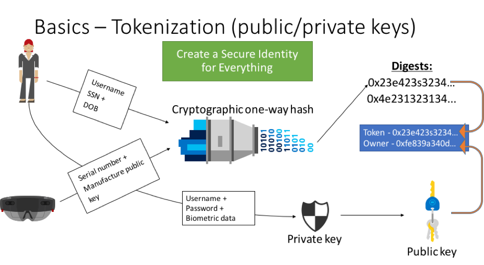

For example, if a screwdriver manufacturer creates a new screwdriver, they could tokenize the screwdriver and record it using the digital signature of the manufacturer establishing provenance.  Then, once sold and shipped to a distributor, a transaction transfers ownership of the tokenized screwdriver to the distributor (public key).  This transfer of ownership is confirmed by signing the transaction with the same digital signature of the manufacturer.  The distributor can repeat the same exercise using their keys when selling the asset in the future, documenting the lineage of that screwdriver as it navigates the supply chain.

Tokenization and signing with public/private key pairs in the blockchain world establishes provenance, documenting the moment a thing is recorded.  Public key can be used to support buying, selling, trading, insuring and tracking of things across organizations thus creating a full audit trail of the tokenized object itself, or lineage.

Tokens can and usually are bundled together in a collection. The collection can also be tokenized creating a composite token of all the tokens contained within. For example, if every phone part were to be tokenized and assembled into a phone, the phone itself could be represented with a token made from its parts.  

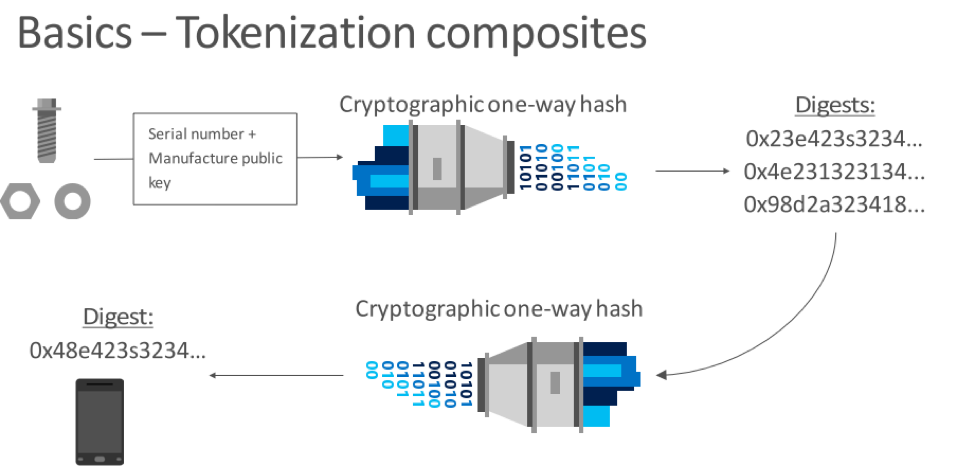

This allows assets to be tracked individually and collectively across organizations which is not possible with today’s serial number and SKU system.

Tokens can represent all sorts of things including people, institutions, commodities, contracts and even digital currencies and sovereign or fiat currencies via pegging to existing fiat currencies. The list of things that tokenization can represent goes on and on across Equities, Bonds, Derivatives, Insurance, Loans, Diamonds, Cars, Parts, Receipts...


### Blockchain = Cryptographically Authentic, Shared, Distributed Ledger ###
- Cryptographically Authentic – Uses tried and true public/private signature technology that is the backbone of e-commerce and digital signatures today.  Tokenization using this technology allows the creation of a Secure Identity and transactions that are impervious to fraud establishing a shared truth.
- Shared – Blockchains have little value within a single organization or company. Its value is directly and arguably exponentially linked to the number of organizations or companies that participate in them. There is huge value for even the fiercest of competitors to participate with each other in these shared database implementations.  Blockchains can be public or “members only” networks providing truth without the need for intermediaries.
- Distributed – there are many replicas of the blockchain database and no one owns it.  In fact, the more replicas there are the more authentic and secure it becomes.  When one asks the question: “How secure is the blockchain?” it is usually answered by stating the number of nodes in the network.  
- Ledger – The database is a write-once and read-many database so it is an immutable record of every transaction that occurs.  There is no update or delete like in a traditional database.  Just as in accounting, if a mistake is made on the ledger it cannot be erased.  A compensating transaction must be posted to correct the mistake.  So there is nowhere to hide.

You can think of blockchains as simple ledgers.  In fact, the database itself is quite simple which usually only contains the public addresses of the parties, tokens of things and key fields that the application puts into each transaction. 
 
Since the public keys of parties involved and tokens can represent large amounts of “off-chain” data just by their token, there is no need to store in-depth detail in the database.  This allows you to store sensitive information elsewhere and simply use the public key to refer to it.

The term “blockchain” is actually the process of how the database is stored.  Transactions themselves are tokens that are placed into a block that are signed by their owners with their digital signature.  This block is a collection of transaction tokens that is then tokenized itself, like a block signature.  This block signature is then stored in the next block created making the two blocks mathematically linked. 


For a transaction to be valid, the address tokens must be valid as well. For example, in order to create a token for an object, you as an individual need a token as well which is usually called an account.  When you create an account, you are establishing provenance for your identity (anonymously or not).  Once you have an account, you can create transactions by signing them with your private key. 
 
When another person creates an account, you can then interact with that person.  Here two people exchange ownership of another token (phone).  Note that the original ownership remains in the ledger as history…or lineage.


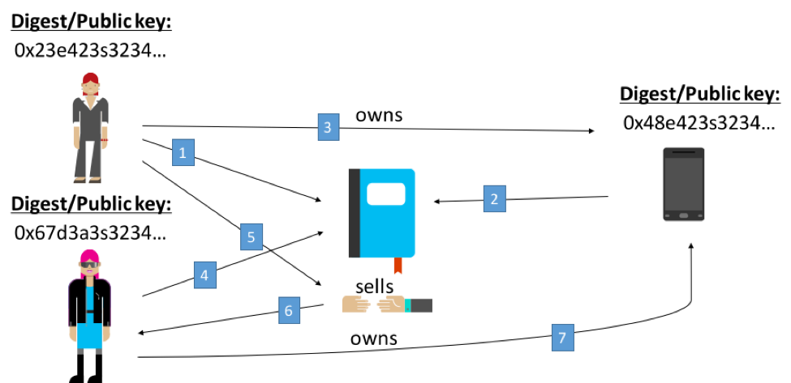

Using this simple database, that is authentic, shared, not centrally owned and immutable allows for a shared truth to resolve all sorts of lengthy human intensive processes.

In summary, combining tokenization with an authentic shared ledger which every participant agrees represents the immutable truth has the potential to remove massive amounts of manual, time consuming “agreement” periods dedicated to settlement.  Not only does it remove the unnecessary settlement time (*note some settlement time may still be desired*) but also the reactive fire drills required when an audit is requested by a regulator or law enforcement.  The full audit trail is created in real-time during the transaction as a by-product of using blockchain technology.  Providing an auditor access to this log in real-time is now possible as opposed to the labor-intensive look back nature of auditing today.  
  

### Current Blockchain Ecosystem and Evolution ###

***History repeats itself…evolution***

Much like 2-tiered client server technology evolved into a 3-tiered architecture creating middleware (J2EE, COM+), the blockchain ecosystem is going through a similar evolution.

Bitcoin’s blockchain is often referred to as Blockchain 1.0.  It is a simple database or ledger that records transactions in sequence and represents the state of the network at any given moment.  Essentially it is a distributed state machine.  It can also be compared to the first relational databases where referential integrity was the main function via primary keys (PK) and foreign keys (FK).  Bitcoin, Hyperledger, Bitcoin Forks or UTXO platforms fall into Blockchain 1.0.


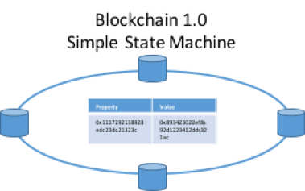

RDBMS systems evolved to include logic in the form of stored procedures to assist with more complex data operations.  Much like this, distributed ledgers have added a logic tier in the form of Smart Contracts. This code exists alongside the data in the database.  This can be thought of as Blockchain 2.0.  Ethereum, Eris and others fall into Blockchain 2.0

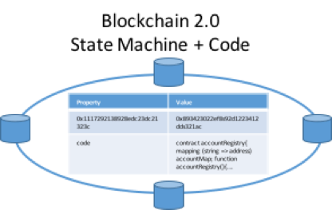

This added code is called SmartContracts.  These SmartContracts operate just like tokenized programs, they have public keys just like any other thing on the network, however they have code and can “do” things like a stored procedure would.  SmartContracts offer a lot of promise to create intelligent systems with self-enforcing contracts to allow business processes to operate independently.  

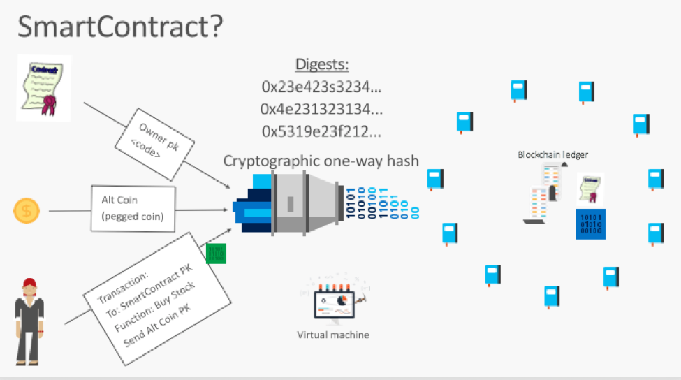

Blockchain 2.0 and 1.0 differ in how things are tokenized and are transacted against.  A SmartContract is essentially a ledger of itself within the distributed ledger.  Tokenized assets exist within SmartContracts themselves.  Whereas 1.0 UTXO databases transact directly against tokenized assets and their unspent transaction outputs (UTXO).  This is not the forum to discuss which approach is better, but its safe to assume that both types of systems will exist and in fact a good argument can be made that both are needed.  An example of this could be tokenizing entities like people, organizations, assets, commodities…actual things which are created or “provenanced” on a UTXO blockchain and the applications or contracts that work with those items are “provenanced” on SmartContract based systems.  It is trivial to record the public key or hash of an item created in a UTXO database within a SmartContract. 

Early blockchain applications and proof-of-concepts have found the need to have these systems interact with the outside world for time or event based things.  To allow for these applications to do so, the use of “oracles” has emerged.  Oracles can inject real world events into the blockchain database like providing a point in time price, recording actual coordinated time or an interest rate.  However, the introduction of “oracles” into these 1.0 and 2.0 system exposes what is supposed to be a deterministic execution into one that can be subjected to untrusted randomness.  How does one know or trust that, say the LIBOR, is coming from a trusted source? Is the entire environment where an oracle and inject values into the blockchain secure?

# <a name="bletchley">Code Name “Bletchley” Overview</a>

Open source technologies will serve as the building blocks for this ecosystem.  Supporting open standards for protocol level implementations of Peer-2-Peer/networking, consensus, database and virtual machines are key in establishing trust within the larger ecosystem and accelerates innovation.

**Core/Kernel/Universal Protocol**

Azure will remain open to all protocols, consensus algorithms, databases and virtual machines.  However, Bletchley will introduce a modular framework allowing for you to choose what combination of technologies best fits the business domain you are trying to address.  Because each blockchain/distributed ledger will have all nodes on that network agree, there will by default be many ledgers.

Public blockchains like Bitcoin, Ethereum and others will define their protocol stacks, however consortium (new way to refer to member/private/permissioned blockchains) distributed ledgers will define their networks based on the business they are addressing.

***Public Network Node***

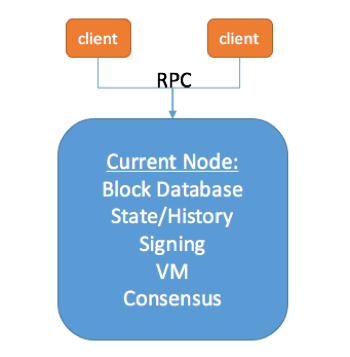

For example, in financial services, a distributed ledger that meets the performance, security, privacy, regulatory and functional requirements for a derivative contract will be different from one that does cross border payments.  So there will need to be two separate distributed ledgers operating those networks.  This will NOT require a 1-1 mapping between product and blockchain since similar products can reside on the same distributed ledger.

***Enterprise Consortium Node***

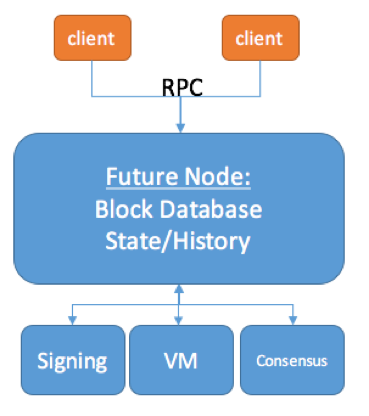

A modular framework will allow consortiums to pick the best of breed components and build their distributed applications regardless of the detail underneath.  Additionally, it will allow for the components to change barring any dependencies created above the core layer.

## Bletchley introduces Cryptlets ##

Cryptlets are the principal building blocks for introducing a secure blockchain middleware tier into the architecture. Given the distributed nature of blockchain, this middleware naturally functions as a service in the cloud (Azure/Azure Stack, AWS, Google, Private) and is more accurately called an Application Fabric. 

In what is referred to as blockchain 1.0 & 2.0, if external data or events based on time or market conditions needs to interact with the blockchain, an “oracle” is required.  There is no standard way to supply “oracle” data securely, which can quickly become an issue in multi-party SmartContracts.  Calling code or data outside a SmartContract or blockchain in general is breaking the trust barrier threatening the authenticity of the dependent transactions.  Cryptlets supply this functionality.


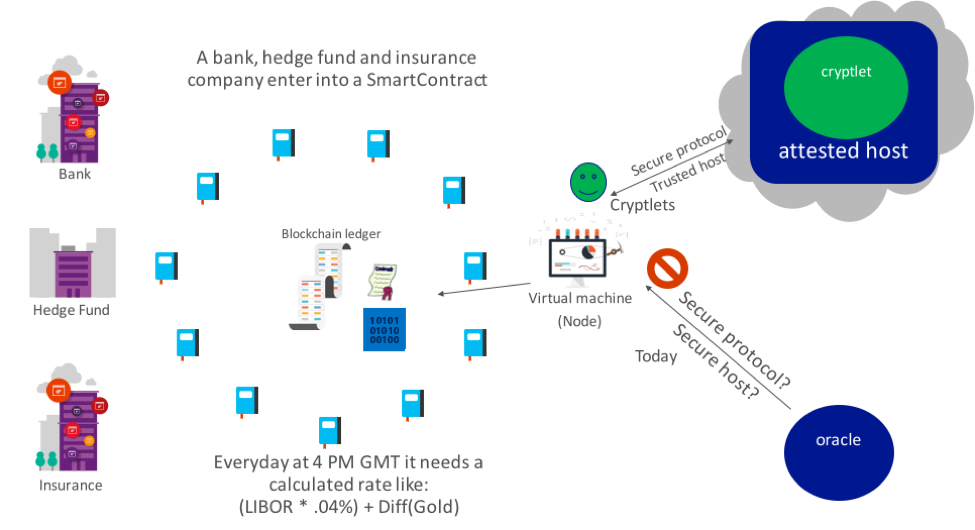

Cryptlets are off-chain code components that are written in any language, execute within a secure, trusted container and communicated with using secure channels.  Cryptlets can be used in SmartContracts and UTXO systems when additional functionality or information is needed and provided via a “CryptoDelegate” or adapter.

A CryptoDelegate is the function “hook” within the SmartContract Virtual Machine that calls the Cryptlet from the SmartContract code extending the secure and authentic envelope for transactions.  Cryptlets are registered at the attested host^1 and referenced or created automatically by developers.

There are two basic types of Cryptlets; Utility and Contract.  Utility Cryptlets make up the bulk of blockchain fabric providing horizontal services like encryption, time and date events, external data access and authentication services.  Utility Cryptlets each have their own identification and attested signatures that are registered for use in the cloud.  Developers can discover and enlist Cryptlets into their SmartContracts to create more robust and trusted transactions.

Contract Cryptlets are full delegation engines that act as a SmartContract surrogate off the chain.  These Cryptlets provide all the execution logic and securely store the data in the SmartContract.  Contract Cryptlets are bound to their SmartContract and created on the fly when the SmartContract is deployed to the blockchain.  Because Contract Cryptlets do not execute in the Virtual Machine they do not run on all nodes in a blockchain, they can run in parallel and execute on vertically scaled systems for greater performance.

Contract Cryptlets can function as autonomous agents or bots, interacting with the world off the chain while maintaining the integrity of the blockchain and SmartContract itself.  Contract Cryptlets are attractive to consortium blockchains where SmartContracts are signed by known counter-parties and there is no need for execution of the logic to run globally.  This will allow SmartContract based blockchains to scale their computational power as well as their overall performance.

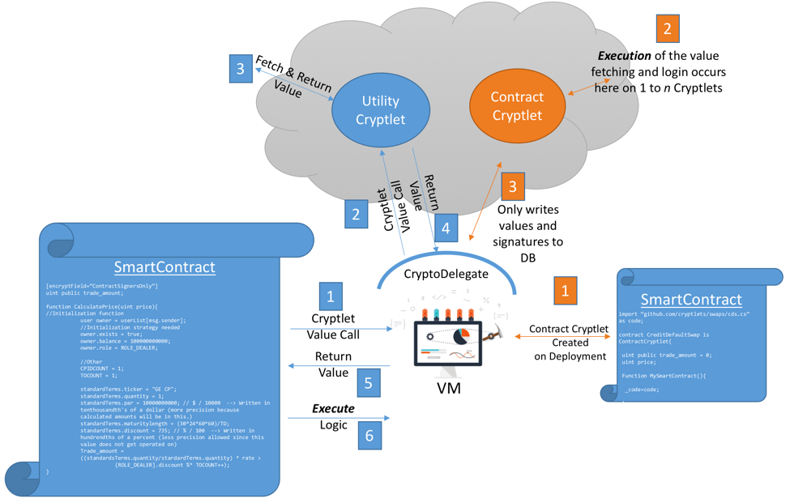

When a SmartContract needs to use a Cryptlet, a CryptoDelegate is called using aspects within the smart contract language, like Solidity.  Attributes can be placed in the code indicating that execution of logic at the attribution point is delegated through the CryptoDelegate.  For example, if a property in a SmartContract needs to be encrypted and only visible to counter-parties to the contract an attribute like this can be applied.


```
[encryptField=”ContractSignersOnly”]
uint public trade_amount = 0;
```

The attribute would specify that the field is to be encrypted, but not how.  That is determined at runtime based on policy set in the cloud.  Registration of Cryptlets is maintained by a blockchain for the network and linked to policy stored by Bletchley.

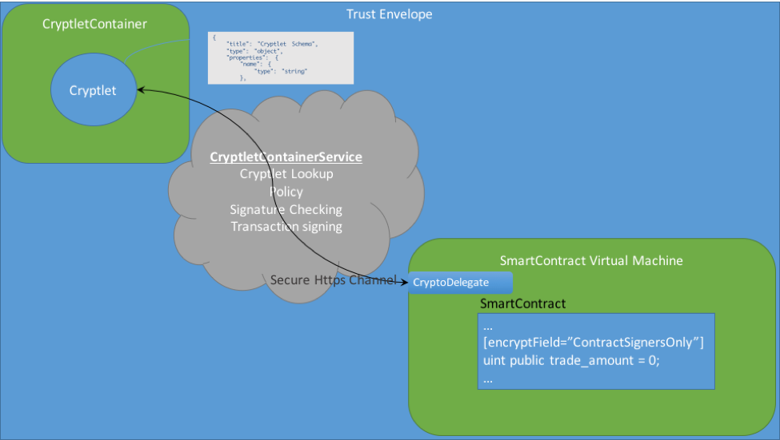

Using Cryptlets via the CryptoDelegate, the security envelope is extended from the SmartContract on the blockchain using secure communications(HTTPS/SSL), attested hosting, key verification and signature recording in the SmartContract by the Cryptlet providing the service.  Optional Cryptlet attributes can also provide for process isolation for additional levels of security.

Additionally, Cryptlets and or their CryptletContainer could be signed by or include digital signatures from identities that the Cryptlet could do work “on-behalf of”.  For example, a user could create a Cryptlet and sign it with their digital signature and when invoked would perform actions as an agent for the user in a business process.  

The addition of this Cryptlet Fabric tier can be thought of as Blockchain 3.0; Data and Logic on a chain with Cryptlets called via a CryptoDelegate from a Smart Contract for off-chain functionality.


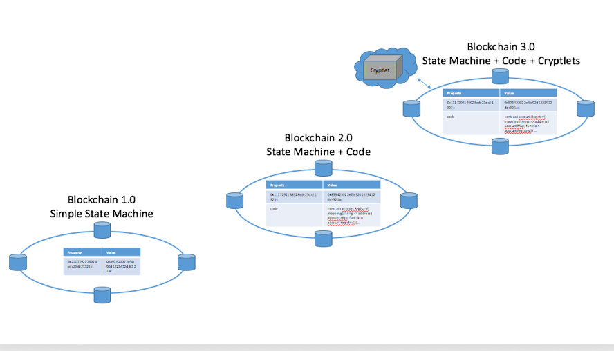

## Blockchain Fabric ##
Since a distributed ledger network’s value is multiplied by the number of different participants, it becomes obvious that consortiums will dominate the landscape.  This brings up the need for interoperability.  And while we are at it…management and operations, privacy, identity, key management and an enhanced execution model rounds out the list of initial enterprise consortium requirements.  There will be more, but we have to start somewhere.

Blockchain Fabric is essentially an “Enterprise Consortium Distributed Ledger Fabric” that would look and feel like traditional middleware, except it would span the globe functioning largely as APIs or Platform as a Service.
 
This Fabric would provide the following core services:

- **Identity and Certificate Services** - functionality found in both Azure Active Directory and Key Vault to provide PaaS services for authentication, authorization, key issuance, storage, access and lifecycle management.  Providing Cryptlet registration and policy as well as establishing identity for people, organizations, key transactions and contracts and things, this service can be a platform for others to build vertical services like a KYC (“know your customer”) service, asset registration and federation, etc.
- **Encryption Services** – partial payload encryption, or field level encryption for blockchain transactions with various encryption schemes (homomorphic, threshold, etc.) to make secret those values that should only be seen by the owner and counter parties + regulators
- **Cryptlet Services** - attested hosting for cryptlets to be securely invoked by CryptoDelegates in SmartContracts or UTXO adapters.  Services like location, trust validation, secure isolated containers will provide the runtime for cryptlets written in any language to be (deterministically) executed.  Specifications for CryptoDelegate, Adapters and Cryptlets will be released to the community via open source so they can be implemented in other distributed ledgers.
- **Blockchain Gateway Services** - [Interledger](https://interledger.org/)-like services to allow for SmartContracts and tokenized objects to be passed between different ledger systems. This service can provide transactional integrity to inter ledger transactions like transfer of financial instruments in a supply chain that spans several blockchains.
- **Data Services** - key data services like distributed file systems (IPFS, Storj, etc) of off-chain data referenced by public keys.  Auditing, Advanced Analytics, Machine Learning and Dashboarding services for SmartContracts, Blockchains, Consortia and Regulators.
- **Management and Operations** - tools for deployment, management and operations of enterprise consortia distributed ledgers will bring the enterprise maturity lacking in the market today.

***Bletchley***
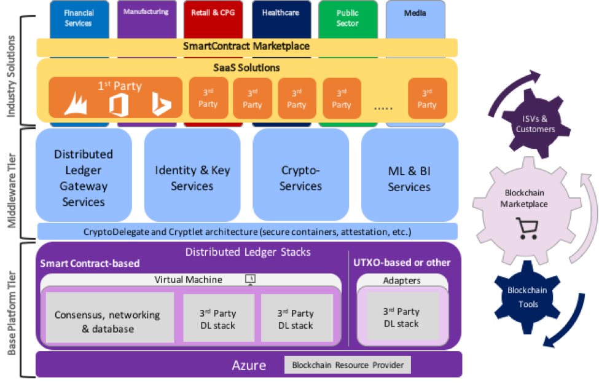

The Base Platform Tier can be any SmartContract (Ethereum, Eris, etc.) or UTXO (Hyperledger, etc.) implementation.  If the actual platform chosen supports the Bletchley pluggable model, then the underlying modules can be swapped out for partner offerings like Tendermint and Intel’s POET.

The Fabric Tier can be consumed by any consortium node either by direct integration of the CryptoDelegate in the VM or UTXO Adapter, regardless of the node’s location (Azure, AzureStack, private datacenter, AWS, etc.).

Fabric to provide the common Enterprise Consortium Blockchain Fabric needed for vertical solutions to be built.  Integration of existing tools can expose distributed ledger capabilities to end users in a manner with which they are familiar.

Additionally, whole new categories within the Marketplace can be developed.  Base platform components, additional distributed Fabric services, Cryptlets as well as full SmartContract libraries can be discovered, purchased and used right within the tools end users use every day.

A bank can create a certified Commercial Loan SmartContract and list it on the marketplace to get paid for each instance created.  A small business owner can select a OpenProjectFundingRequest SmartContract to crowd source his next project.  A developer can find a KYC Cryptlet that will meet the requirements for his application and a consortium can discover the next best consensus algorithm to try out to improve their performance.

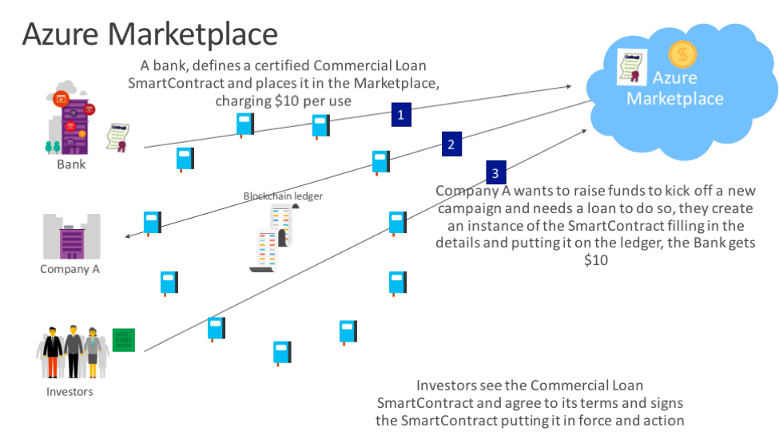

Eventually, Consortiums will form and settle into their networks.  These consortium networks will begin interoperating with each other with transactions, value and ownership transfers as well as provenance and lineage tracking across ecosystems.  With the inclusion of Machine Learning watching these distributed ledgers, who knows what we will discover.

***Example Consortium***
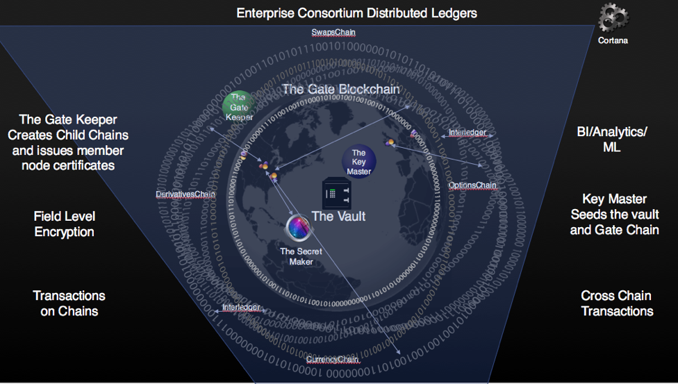

# Summary

The evolution of blockchain implementations mirrors that of the web generation of technologies.  We see the need for middleware to be introduced into this ecosystem to supply enterprise grade services around identity, security, cryptography, scale, tooling, management, monitoring and reporting.  The difference this time is the cloud.
  
The blockchain ecosystem is full of companies large and small with great ideas for addressing performance, security, integration, management, etc.  Bletchley is Microsoft’s approach for architecting a cloud fabric that is open to all contributors, modular by design and a great place for our partners to build solutions addressing industry specific workloads.

Creating this open ecosystem will take some time.  But if done properly the combination of Distributed Ledgers and the Cloud can usher in the new collaborative economy.

More about Bletchley will be disclosed and discussed at [Microsoft's World Wide Partner Conference July 12-16th in Toronto.](https://partner.microsoft.com/en-US/wpc)  See you there!

^1 *Similar to [Codius](https://www.codius.org/)* suggested by [Ripple](http://ripple.com)
_____
*This project has adopted the [Microsoft Open Source Code of Conduct](https://opensource.microsoft.com/codeofconduct/). For more information see the [Code of Conduct FAQ](https://opensource.microsoft.com/codeofconduct/faq/) or contact [opencode@microsoft.com](mailto:opencode@microsoft.com) with any additional questions or comments.*
