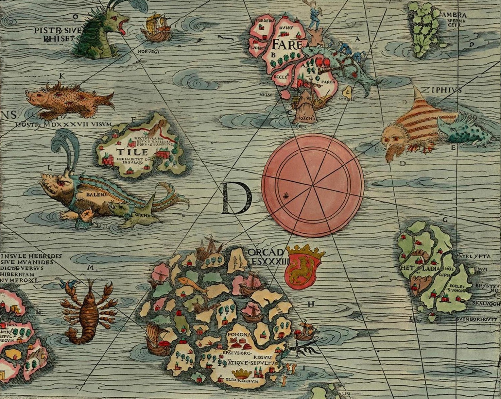

# The Token Map

## A blockchain related series about Tokens, Contracts and Identity...oh my

Welcome to the Token Map, your trusty guide for Tokens, Contracts and Identity in the exciting world of blockchains.

## Start

If you are new to blockchains (a.k.a. distributed ledgers) or even been immersed in them for years, you may find yourself helplessly confused or lost in the deep dark woods. You may be asking yourself, what is this all about? What was I doing in the first place?

The Token Map is for you.

Here we take a step back, or zoom out if you will, to reevaluate the big picture. What makes blockchains seem so interestingly magical to some and often dismissed by others?

The internet is riddled with introductions and guides for you to grasp the basic concepts involved when approaching blockchains. So we will not dip into the whole distributed consensus algorithms burrow nor will we debate varying approaches of achieving some usable level of privacy.

But often, those who are immersed in experiments or proof of concept projects, come up for air and ask themselves, couldn’t I have just used a traditional database or application for this? Is what I am trying to do even a valid use case for blockchains?

And shouldn't the previous question be: Is what **we** are trying to do even a valid use case for blockchains?

So, this map will bring you back to the basics and help guide your thinking and approach to true multi-party, distributed applications using blockchain technologies.

But first, a bit of level setting here for our first topic, Tokens. There are currently two token universes at the moment. A public universe heavily tilted towards crypto currency use cases that features a diverse and wide selection of blockchain choices each of them differentiating themselves on the technical underpinnings and evolving new economic models. And an enterprise or corporate universe that provides a narrower choice of blockchain technologies focusing on evolving existing economic models with a more diverse and wide view of tokens.

At some point the boundary between these two universes, public and private, will blur as the technology and social, economic, legal, regulatory and practical aspects involved with this disruptive technology matures.  But for now, it’s pretty safe to think that the use of tokens in the public universe is narrowly focused on different versions of money or crypto currency and the private universe is widely focused on tokens that are not.

Again, this will change and there are crossovers and I’m sure someone will take offense at this generalization, which is probably an indication that this paper is not for you.

## Building Blocks

There are 3 basic building blocks: Tokens, Contracts and Identity when conceptualizing a blockchain application.  Before we jump in, lets pin a simple definition of what the underlying blockchain or shared ledger is:

>A shared ledger uses cryptography that is trusted by multiple parties to authentically represent tokens or assets of value that can be owned by accounts belonging to the parties that trust it.

Wow, that is a mouthful and can get WAY more complicated. But for all intents and purposes, this definition of a ledger that represents a shared "truth", or is really good at establishing authenticity using cryptography is the only thing you really need to understand to be able to envision what you might be able to do with it.

## Tokens

### Monopoly and Bearer Instruments

Tokens are representations of something. Think about the board game Monopoly - the whole game is tokens. You have the game piece that each player chooses to represent themselves in the game. You also have the property cards a player purchases. Oh, and the money the players earn and use to purchase those properties and the "Get out of Jail" card a player can draw when they get into trouble.

Each of those things represents a token, but these tokens are not of the same type.  A game piece represents a player, or say an identity or account.  The money represents, well, physical money and the property cards represent a land deed or title.  Note, the property cards also contain details like rents or fees which represent contracts, which we will cover later.

In the Monopoly game, the money and property cards are *bearer instruments*. Meaning, a player can be the owner of money or property, no strings attached. Which is to say, when the game is over, no record is kept of who previously owned a property or held that particular $500 bill.  So a bearer instrument is anonymously sold or redeemed.

>Note, we are using the term bearer instrument generally to describe the concept not describe actual financial instruments

You know the saying, "possession is 90% of the law", well that means if you possess or bear the instrument, say a dollar, you are the owner and can do anything you want to with it. Physical money, in your hand, pocket, etc. is a kind bearer instrument. Historically, so were some stocks, bonds and titles as proof of asset ownership. These are pretty scarce today for numerous reasons, which we will get into later.

So, digital tokens are not generally bearer instruments, in fact by default they are anything but. A blockchain token has a full history or lineage which can be traced back to its origin. This level of scrupulous record keeping makes it difficult to hide if your account number happens to become is known.

Anyway, discussing the history of bearer instruments is really useful in understanding how token can represent something valuable. A digital token can represent some asset of tangible value, which is owned by another token that usually represents an identity or account.

>Translation: The dog owns Park Ave...which means if you are the player who chose the dog, you should have the Park Ave. property card on your side of the board.  Lucky you!

### Authenticity

Back to bearer instruments, they belong to the holder and are used just like physical money.  The single most important thing about any bearer instrument, regardless of its form, is its **authenticity**.  

For example, if you have a $100 bill with a serial number of `H4829310239` and come across another $100 bill with a serial number `H4829310239`, one of them is a counterfeit. But which one?  

How much is your $100 worth now?  $50? No $0 - you can't trust the dollar bill your are holding.

A bearer instrument's value is a zero sum game of confidence. Absolutely authenticity or the extreme unlikelihood of being able to produce a convincing counterfeit, is the name of the game.

Where does this trust in authenticity and how do we determine it?  Well it depends on the properties of the instrument.

### The Journey From Gold to Bearer Instrument

The authenticity of gold coins was initially determined dentally, which at the time meant evaluating coins was risking your gleaming smile as the dentist was also likely the town blacksmith. Anyway, a gold coin is not a bearer instrument because the coin itself has value. You could melt it down into a gold blob and its value would be the same. Because of this, gold coins were of great value in of themselves but came with a lot possession risk that often led to problems dwarfing the state of your dental health.

It wasn’t until the issuers of coins began plating rubbish materials with precious metals that their value was greater than their melted form. This was an interim step in the direction of full on material substitution to make the coin by using low valued metals and even paper to represent a blob of gold held by the issuer of the coin.

>The bearer instrument was born, well kind of. Meaning, the notion of a token as the bearer instrument representing value located somewhere else. Risk in using gold as currency could simply be the possession of them, with a bearer instrument the risk resided in determining authenticity when accepting it as payment for your labor or an asset you are selling.

If a rubbish material coin or paper bill represented a certain quantity of gold held in the issuers coffers, safe or vault, the bearer of the coin or bill could march right up to this institution and exchange the bearer instrument for the amount of gold it represented.

This is often called the Gold Standard, which technically its not, regardless this token scheme was the trust anchor underlying fiat currencies around the world until the early 1970s. The bearer of these instruments trusted that the institution that issued it had the gold to back it up, so all they had to worry about was that the instrument itself was authentic.

>Note, historically, minted coins where government issued currency and paper notes were bank or institutional issued instruments. This was the norm, until a sufficient number of crisis and fiduciary judgement days required for humanity to eventually learn that was generally a bad idea.

So, in a way, a good measure of the general trust in a currency is the length in which someone will go to thieve them from you instead of attempting to counterfeit it.

Gold backing provided part of the trust equation representing value for bearer instruments, but what about authenticity?

Minters of coins and issuers of paper currency employed difficult to duplicate properties that could almost instantly calm any concern by its holder as to its authenticity. The molds or plates used to generate these instruments had fine detail that at the time of their issuance was difficult to duplicate in order to create an effective counterfeit at scale.

Counterfeiters, would experiment and eventually be able create "good enough" instruments or just steal the molds or plates. This would then cause a new series of instruments to be created moving the difficulty bar further out.  This continues to this day, all around the world.

Determining authenticity wasn't just an issue to the general public, but to governments and the minters they employed. The United Kingdom, in the twelfth century, began regular inquisitions called the [Trial of the Pyx](https://en.wikipedia.org/wiki/Trial_of_the_Pyx) for the minter to prove conformity to a jury of metallurgical assayers, just in case they were skimming or creating extras. This too continues to this day.

Perhaps the most interesting aspect of today's currencies is that they are not backed by gold, but trust in the backing government and authenticity.  This, to most, is **magic**.  However, the authenticity challenge persists.

Ok, enough of that, let's get back to physical money which can be thought of as a type of token, let’s examine properties and behaviors of money.

### Physical Money - Properties and Behaviors

Often it's useful to state things that are obvious and clearly understood about money and then applying these concepts to tokens. For, as you will see, properties and behaviors provide ways of distinguishing different types of tokens.

#### Properties of Money

- Look & feel - physical properties that can help establish authenticity almost immediately and can be verified with further scrutiny.  Paper quality, holographs, etc.
  
  >Note: Interestingly, the amount of intricate detail implemented can actually make it easier to fool people into accepting counterfeits that are deemed to have the same level of intricacy at first glance.

- unique serial number
- series information
- a denomination
- etc.

#### Behavior

- subdivides into smaller denominations, or making change
- can be coalesced into larger denominations, for example, converting a bucket of coins into a much lighter bill
- interchangeable value with any other money of the same denomination
- supports supply control, central banks can “print” more money and also remove older series that are susceptible to counterfeiting or to implement [monetary policy](https://en.wikipedia.org/wiki/Monetary_policy)

Now, let's translate these concepts that all readers should be familiar with into **token jargon**.  This jargon is used for basic token types or categories, and when combined with a selection of many different behaviors, is adequate to fully describe everyday tokens like airline tickets or an annual club membership.

### Fungible

Examining physical money introduces us to fungible tokens.  These tokens have interchangeable value with each other, meaning that any quantity of them and their sum value has the same value as another quantity's sum value. This can be nuanced in some scenarios which require quantities be in the same class or series.

Or put very simply, a pile of cash equal to $1,000 made up of 10 $100 bills has the same value as $1,000 comprised of all pennies ($.01).  In this case, the value of carrying 10 pieces of paper vs. 1,000,000 coins depends on the physical fitness goals of the bearer.

Obviously, there is additional value nuance in this example when the bearer instrument is affected by gravitational forces and technically not in the same class. In the physical world, subdividing a bearer instrument not designed to subdivided creates serious concerns as to the authenticity of the resulting torn bits of paper.

Physical cash consolidation by money changers (central banks and their commercial arms) provide services to convert your subdivided bits into whole larger bits equal in value, for a fee.  Today this conversion is usually physical to digital in the form of a deposit or vice versa.

Tokens representing digital money do not require money changers within the same class and those pesky gravitational forces are hard to notice outside of quantum states and thus not a burden for the bearer.

It can get *WAY* more complex than this, but describing the benefits of a crypto currency as:

 >...not requiring money changers and being less susceptible to gravitational forces that can decrease portability...

will quickly end those pesky dinner party conversations about them.

### Non-fungible

A non-fungible token is not interchangeable with other tokens of the same type as they typically have different values.  A car title is a good example of a non-fungible token. For example, a title to a 1971 Ford Pinto does not have the same value as one for a 2019 Porsche 911.  

Baseball cards, Comic Books, Art and [CryptoKitties](https://en.wikipedia.org/wiki/CryptoKitties) are other examples.

### Hybrids

#### Shared non-fungible base with fungible and non-fungible tranches

These tokens often share a common non-fungible parent or base token and then can have tranches of tokens (both kinds) that are possessed by owners. An example of a hybrid is a concert or theater ticket, where the parent token represents the specific date or showing of the concert or play and then tranches for the various seating sections or general admission.

General admission tickets fungible in their tranche, but reserved seating are not.

#### Fungible class owns many non-fungible (usually singletons)

A token can be the owner of another token or any number of tokens to represent the compound value of the underlying tokens. For example, you could create a fungible token, where the `token class` owns a pool of non-fungible tokens.

>A `token class` is like an equity share, like a stock. This class is issued with a certain quantity or shares, where each share represents the same fraction of ownership for whatever company the class represents. A token class is also like a physical money denomination, like a $1 bill. This class can be defined by denomination and series, where the series represents a version. So a $1 bill is a class that can have multiple series in circulation at the same time and should be interchangeable within the class regardless of the series. This allows the central bank to recall a series removing it from official circulation without having to retire the whole class.

When this token class owns another non-fungible token, that means that each token in that class owns a fraction of the non-fungible token. A mortgage backed security is a good example, where we can create a single security (token class) and make it be the owner of a bunch of non-fungible mortgage tokens and then sell instances of this new security to a bunch of investors where each token owns a fraction of the mortgages owned by the class.  Mutual Funds and lottery pools are variations on this theme.

### Properties

Tokens usually have a common name, a symbol or unique identifier, a quantity and an owner.  These values belong to the `token class` where instances of this token will have these same values.

There are two types of properties, behavioral and non-behavioral. Non-behavioral properties can be added to a token without effecting, well, its behavior, like a serial number, SKU or generic tags. Behavioral properties, on the other hand differentiate token types from each other.

For example, you can create a property title token that uses a base non-fungible token and adds non-behavioral properties like a map number, plot location, etc. and it can be a fully functional token. You can repeat this process for an art token that uses the same base non-functional token and adds non-behavioral properties need to represent it. These tokens have the same behaviors but represent completely different assets by having different non-behavioral properties or even non-behavioral property values.

>Definition: a token template is a set of technical artifacts, code, configuration, etc. that a token class is created from. Property title tokens in the example above are created from a single template, which is a non-fungible token with non-behavioral properties like map number, etc. You use this template to create a token for each property needing a title, over and over again. Technically this same template can also be used, perhaps with slight modification, for Art. Art and land have the same behaviors, but have different non-behavioral properties.

So tokens start out as either fungible or non-fungible, with a common set of base properties and then diverge from each other based on their behaviors.

### Behaviors

Behaviors are capabilities or restrictions and can be common across fungible and non-fungible types or only apply to one of them. Behaviors have supporting properties which are incorporated in the token schema and definition.

Behaviors are very business specific and usually have existing “non-blockchain” implementations which are well understood.

Here are some common behaviors.

- Transferable – the ability to transfer ownership of the token. Basic fungible behavior when using cash money, but also applies to non-fungible tokens.
- Non-transferable – the restriction of preventing a change of ownership from the initial issued owner. A vote token for an election or an airline ticket are examples.
- Sub-dividable – these are essentially the decimal places a token can be subdivided into. For example, a dollar supports 2 decimal places. A zero decimal would prevent subdivision or the ability to own a fraction of a token, these are referred to as whole tokens.
- Mintable – the ability to issue new tokens of the class.  Creating money or barrel of oil to add to the overall supply of the class.
- Burnable – the ability to remove tokens from the supply. A token representing a barrel of oil that gets burned when it is refined is a good example.
- Role Support – the ability to have roles defined within the class to can allow or prevent certain actions.
- Financable or encumbered – the ability to have another token or contract prevent the transfer of ownership or burning until the encumbering is removed. For example, an outstanding loan on a property that is encumbered will require that the loan be paid off before the ownership of the property can be transferred.
- Expirational – the token loses its value based on an event or date. A ticket to the theater is only good for the date of the play and is not valid for the next day’s show.
- Suspendable – a token can be restricted for redemption, transfer or use based on some event. A token that represents a credit may be suspended until some issue with the credit is resolved.
- Extension or Add-on – an optional add on set of properties like a concert ticket with a VIP backstage pass.  Or a cruise ticket with unlimited food and drink.

There are many more of these, in fact there is a [taxonomy effort](../eea-tokens/token-taxonomy.md) underway now if you want to learn more.

## Important Token Concepts

- A token instance, whole or fraction, is a single party unit. Meaning, it usually has a *single* owner and is transacted against in a *single* atomic unit.

 >Translation: when you are paying $1 for a red balloon at the park, your transaction is completed when you are handed your new red balloon and walk away to enjoy it.

- The owner has complete control of it, unless there is an encumbrance present.

 >Translation: this means if you are the owner of a home that still has an outstanding loan backing it, its encumbered and you may not sell it to another party unless you pay off your loan.

- Tokens are meant to be contracted. A transfer on a token will not be aware of any conditions that need to be met before completing. A token receiving a transfer request is not concerned about the external conditions in which the transfer was generated. But the token can have a behavior like encumberable which allows a contract to encumber the token to prevent the transfer to another party until the loan or lean is removed. The token doesn't need to be aware or concerned about how it was encumbered or how it is freed, that is the loan, or contract's job. This allows tokens and contracts to interact with each other seamlessly.

 >Translation: The owner of a home, holds the property title and can transfer or sell their home to a buyer. In that process, the owner's loan encumbering the title from one bank is paid off by the buyer, who, if financing the purchase can use a completely different bank. The buyers new loan can simply encumber the same title after the seller's lean is removed.

A token's behaviors are essentially interfaces or extensions for how the token can be used. For example, if a token is financeable, it has the ability for the owner to accept a lean, representing the loan, which encumbers the token. In this case the loan represents a contract that is bound to the financeable behavior of the token. The loan itself is a multi-party contract with the token owner being the borrower and the financier the lender. The token and the loan operate independently, however only the loan can remove the lean once it is paid in full.  

This brings us back to the important point that tokens are not multi-party contracts, or at least they shouldn't be. Mixing the two together decreases re-use and interoperability. Tokens are meant to represent value that are included in multi-party agreements or contracts, just like a Property Title being encumbered by a loan contract which defines the conditions to remove the lean from the property resulting in the buyer owning the property outright.

A Token behavior can act and react to itself or require an external actor like a contract to invoke it, or internal and external behaviors. Technical people usually call this an interface, but you can think of an external behavior like an electrical outlet and the thing you are plugging into it the contract or even another token.

## What About Initial Coin Offerings (ICO)

An ICO is a class of fungible token that is usually associated with a blockchain platform or product. It typically represents either:

- Equity in a business that is behind the creation of a new product or platform. This makes the equity token holders like shareholders.
- Fuel or utility required to consume the new service being offered.

For the past couple of years, ICOs have been subject to a huge amount of financial speculation. In many cases the companies creating them had sound motives for issuing them, however, a mania built up around them much like dot-com stocks in the late 90s and early 00s. Unfortunately this turned out to be a demonstration of history repeating itself.

Despite this, the concept of using an ICO, or perhaps a new name for them, to start or fuel an initiative is an innovative way to crowd source and address problems like financial inclusion, if implemented properly.

Anyway, we digress, we're interested in how digital tokens can revolutionize business, not financial speculation.

## Contracts

Contracts are covered much more extensively in previous sections of [Bletchley](../README.md). The important concept about contracts is where tokens are single party instruments, contracts are multi-party instruments that can contain terms and conditions for the issuance of control over a token(s).

This, of course, is not exactly a clean distinction.  Because a Token could still have a relationship with its issuer. For example, a token representing physical money is a contract between the holder of the token and its issuer, that they will honor the token as valid currency. However, thinking about this token, as only requiring a single party to spend the token, meaning the issuer doesn't need to approve of the transfer and this token only has a single acting owner or party where a contract can have multiple actors or parties engaged simultaneously, is a good way to frame the difference between a token and a contract.

An example of a contract that is separate from the token, besides a loan, would be an insurance policy or warranty. Contracts can be complex, like a trade involving multiple tokens from different classes. For example a sales contract to transfer ownership of a piece of art using a certain number of Bitcoin where the Buyer transfers Bitcoin to the Seller and the Seller transfers ownership of the art to the Buyer. Sounds simple, but it can be complicated based on business requirements like using an escrow account that will release the Bitcoin when the actual piece of art is received by the buyer.

Separating out Tokens from Contracts is an important concept. Limiting tokens to the set of properties and behaviors needed for a digital representation of value makes them more contactable.

## Identity

As tokens are owned and contracts have counter parties, establishing the identity of these participants and validating them is vital. Blockchain identities are usually represented by a public key or address that is backed by a private key. However, an account is different than an identity.

For example, you have an identity and can have multiple accounts on the same network and on other networks.

Public networks are often called trust-less where the account is all you need to transact, but once you step up to commercial business in a serious way you are going to come up against regulations like KYC where establishing identity behind the account is required.

There are solutions for managing corporate and institutional identities where the institution provides their employees an identity for logging in and using applications like email that they can assign blockchain accounts to.

When you are engaging a company for online services for personal use, you are likely using a personal email address to identify yourself.  However, this really isn't your personal identity, there is still a corporation like Microsoft or Google providing it and you might have one identity from each.  This introduces a wide range of challenges but proposed solutions have tremendous upside that we will not go into here.

To learn more about identity issues and the efforts underway to help address them, [self-sovereign identity](https://azure.microsoft.com/en-us/overview/decentralized-identity) can get you pointed in the right direction.

## Here there be monsters

Well, that is it for now, you have reached the edge of the map. There is a wealth of information available out there, now that you have context. For example, checkout the [Token Map Series](https://www.youtube.com/playlist?list=PLndM9ZTRSX-Yb980yRZIoeqXy3qX9uijU) of videos, for those that would rather watch a video than read a long paper. (Perhaps we should have put this link at the top)

### Token Map Episodes

- [Introduction](https://youtu.be/O4vcsV4EEmU)
- [Authenticity](https://youtu.be/1ZuFeJ6n_8I)
- [Properties](https://youtu.be/RZ4bF8E0w6w)
- [Behaviors](https://youtu.be/mHreyCM12EM)
- [Concepts, Contracts and Identity](https://youtu.be/jxXJGnepFV8)

But beware, the metallurgical assayers are watching you!

